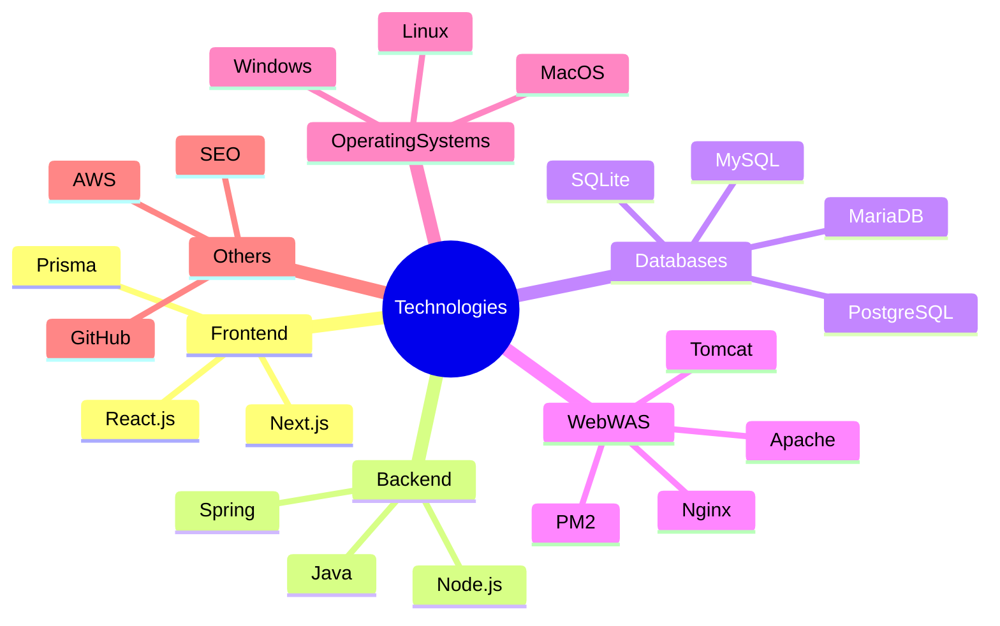

## 👾 Hey, curious coder! Welcome to my GitHub! 🚀

I'm a developer with a strong foundation in both frontend and backend technologies. I love building scalable web applications that solve real-world problems.

### 🔧 Technologies & Tools

### 💼 Current Work
- Currently developing an automated cryptocurrency trading service, focusing on researching and refining investment strategy algorithms.

### 🌱 Learning
- Recently started learning Kysely to enhance my database management skills.

### 🤝 Collaboration
- Interested in creating small, profitable services, and open to collaborating in these areas.

### 📫 Contact
- Feel free to reach out via email at daniel@udit.one.

### ⚡ Fun fact
- When I'm not coding, I enjoy interior design, 3D modeling, architecture, cryptocurrency, and singing.

---

Feel free to explore my repositories and connect if you have any questions or ideas!
